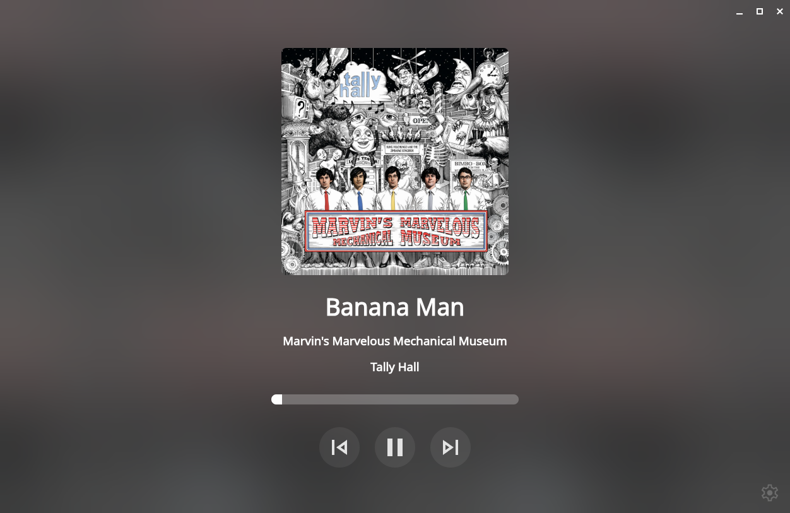

# Musideck

See what's playing currently, with a bit of eye candy!

Musideck running on desktop:


# Desktop app?

There is one in fact! You can use [Musideck-Electron](https://github.com/0hstormy/Musideck-Electron) to connect to your local Musideck server.



# How to use

### Prerequisites:
* A Linux computer with an MPRIS compatible media player (Ex: VLC, Spotify, Exaile, Rhythmbox)
* python3
* flask
* dbus-python

For Debian/Ubuntu:

```bash
sudo apt update && sudo apt install python3 python3-flask python3-dbus -y
```

### Step 1:
Clone the repo and `cd` in with

```bash
git clone https://github.com/0hStormy/Musideck.git && cd Musideck
```

### Step 2:
Install musideck and start it with:
```bash
sudo install.sh && musideck
```

### Step 3:
Open a **modern** web browser and type the following in the URL bar and press enter

```
http://127.0.0.1:5000/
```

## Run a systemd service

```bash
systemctl --user daemon-reload
systemctl --user enable musideck.service --now
```